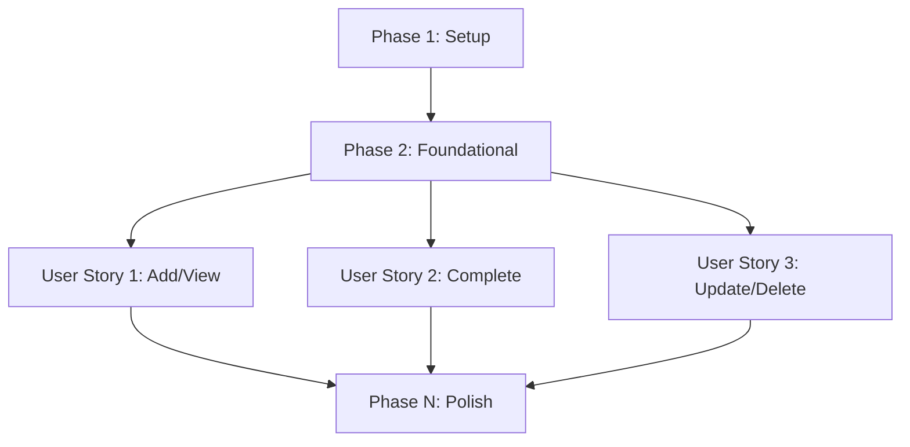

# Tasks: Todo In-Memory Python CLI App (Phase I)

**Input**: Design documents from `/specs/001-todo-cli-python/`
**Prerequisites**: plan.md (required), spec.md (required for user stories), research.md, data-model.md, contracts/

**Tests**: Tests are included as part of the TDD approach requested in the project constitution.

**Organization**: Tasks are grouped by user story to enable independent implementation and testing of each story.

## Format: `[ID] [P?] [Story] Description`

- **[P]**: Can run in parallel (different files, no dependencies)
- **[Story]**: Which user story this task belongs to (e.g., US1, US2, US3)
- Include exact file paths in descriptions
- **Traceability**: All code changes MUST include a comment referencing the Task ID (e.g., `// Task: T001` or `# Task: T001`)

## Path Conventions

- **Single project**: `src/`, `tests/` at repository root
- Paths assume a standard Python layout.

## Phase 1: Setup (Shared Infrastructure)

**Purpose**: Project initialization and basic structure

- [X] T001 Create project structure (`src/models`, `src/services`, `src/cli`, `src/lib`, `tests/unit`, `tests/integration`) per implementation plan
- [X] T002 [P] Initialize Python project with `pytest` for testing in `pyproject.toml`
- [X] T003 [P] Configure linting and formatting tools (e.g., `ruff`)

---

## Phase 2: Foundational (Blocking Prerequisites)

**Purpose**: Core infrastructure that MUST be complete before ANY user story can be implemented

**⚠️ CRITICAL**: No user story work can begin until this phase is complete

- [X] T004 Implement `Task` entity with ID, Title, Description, and Completion status in `src/models/task.py`
- [X] T005 Implement in-memory `TaskRepository` (singleton) in `src/services/repository.py`
- [X] T006 Setup basic `argparse` CLI entry point structure in `src/cli/main.py`

**Checkpoint**: Foundation ready - user story implementation can now begin in parallel

---

## Phase 3: User Story 1 - Add and View Tasks (Priority: P1) 🎯 MVP

**Goal**: Allow users to add tasks with title/description and view all tasks.

**Independent Test**: Add a task via CLI and list it to see the entry.

### Tests for User Story 1

- [X] T007 [P] [US1] Unit tests for adding and listing tasks in `tests/unit/test_task_service.py`
- [X] T008 [P] [US1] Integration tests for `add` and `list` commands in `tests/integration/test_cli_add_list.py`

### Implementation for User Story 1

- [X] T009 [US1] Implement `add_task` and `get_all_tasks` logic in `src/services/task_service.py`
- [X] T010 [US1] Implement `add` and `list` commands in `src/cli/main.py`
- [X] T011 [US1] Add basic validation and error handling for empty titles in `src/services/task_service.py`

**Checkpoint**: User Story 1 is functional and testable independently.

---

## Phase 4: User Story 2 - Mark Task as Complete (Priority: P2)

**Goal**: Allow users to mark a task as complete using its ID.

**Independent Test**: Mark an existing task complete and verify its status via `list`.

### Tests for User Story 2

- [X] T012 [P] [US2] Unit tests for marking tasks as complete in `tests/unit/test_task_service.py`
- [X] T013 [P] [US2] Integration tests for `complete` command in `tests/integration/test_cli_complete.py`

### Implementation for User Story 2

- [X] T014 [US2] Implement `mark_task_complete` logic in `src/services/task_service.py`
- [X] T015 [US2] Implement `complete` command in `src/cli/main.py`
- [X] T016 [US2] Add error handling for non-existent IDs in `src/services/task_service.py`

**Checkpoint**: User Story 2 is functional and testable independently.

---

## Phase 5: User Story 3 - Update and Delete Tasks (Priority: P3)

**Goal**: Allow users to update task details and delete tasks.

**Independent Test**: Update a task and verify changes; delete a task and verify it is removed from `list`.

### Tests for User Story 3

- [X] T017 [P] [US3] Unit tests for updating and deleting tasks in `tests/unit/test_task_service.py`
- [X] T018 [P] [US3] Integration tests for `update` and `delete` commands in `tests/integration/test_cli_update_delete.py`

### Implementation for User Story 3

- [X] T019 [US3] Implement `update_task` and `delete_task` logic in `src/services/task_service.py`
- [X] T020 [US3] Implement `update` and `delete` commands in `src/cli/main.py`
- [X] T021 [US3] Add error handling for updating/deleting non-existent IDs in `src/services/task_service.py`

**Checkpoint**: All user stories are functional and testable.

---

## Phase N: Polish & Cross-Cutting Concerns

**Purpose**: Final refinements and documentation.

- [X] T022 [P] Update `README.md` with final installation and usage instructions
- [X] T023 Final code cleanup and refactoring for consistency across `src/`
- [X] T024 Run final `quickstart.md` validation to ensure all scenarios pass

---

## Dependency Graph



## Parallel Execution Examples

### User Story 1 Parallelization
```bash
# Can be run in parallel:
- [ ] T007 [P] [US1] Unit tests for adding and listing tasks in tests/unit/test_task_service.py
- [ ] T008 [P] [US1] Integration tests for add and list commands in tests/integration/test_cli_add_list.py
```

## Dependencies & Execution Order

### Phase Dependencies

- **Setup (Phase 1)**: No dependencies.
- **Foundational (Phase 2)**: Depends on Phase 1.
- **User Stories (Phases 3-5)**: Depend on Phase 2.
  - Can be implemented sequentially (US1 -> US2 -> US3) or in parallel.
- **Polish (Phase N)**: Depends on completion of all stories.

### Implementation Strategy

- **MVP**: Phase 1, 2, and 3 must be completed first to deliver a working "Add/View" app.
- **Incremental**: Add Completion (US2) then Update/Delete (US3).
- **Traceability**: Every task MUST be referenced in code comments.

---

## Summary

- **Total Tasks**: 24
- **Tasks per Story**:
  - US1: 5 tasks
  - US2: 5 tasks
  - US3: 5 tasks
- **Parallel Opportunities**: Setup tasks, all test tasks marked [P].
- **Independent Test Criteria**: Each story has specific CLI verification steps.
- **MVP Scope**: Phases 1, 2, and 3.